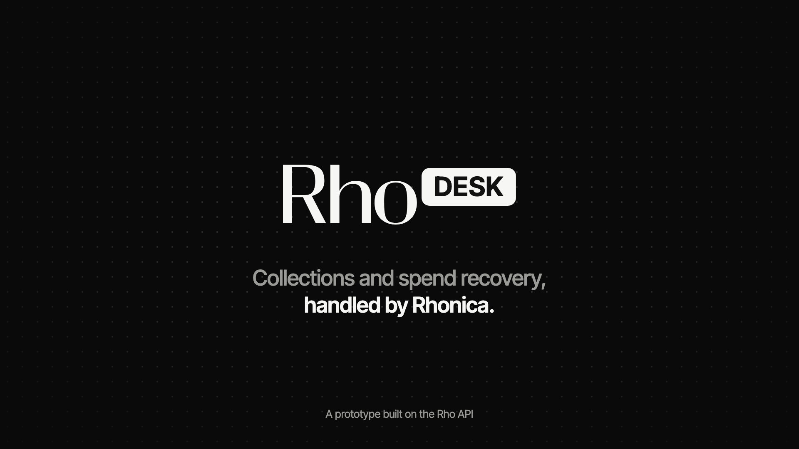
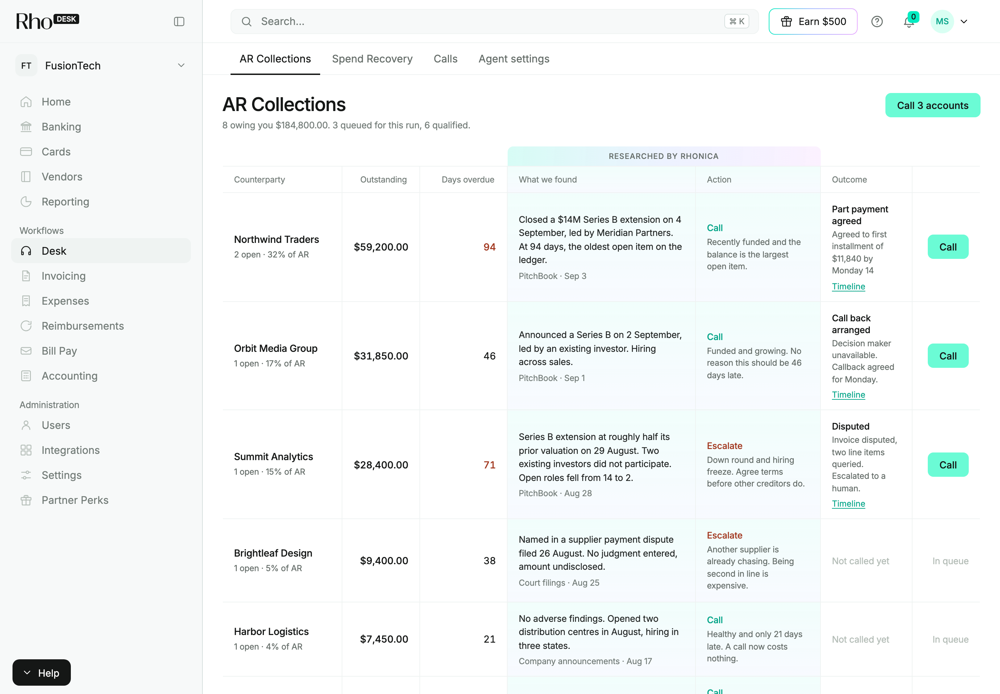
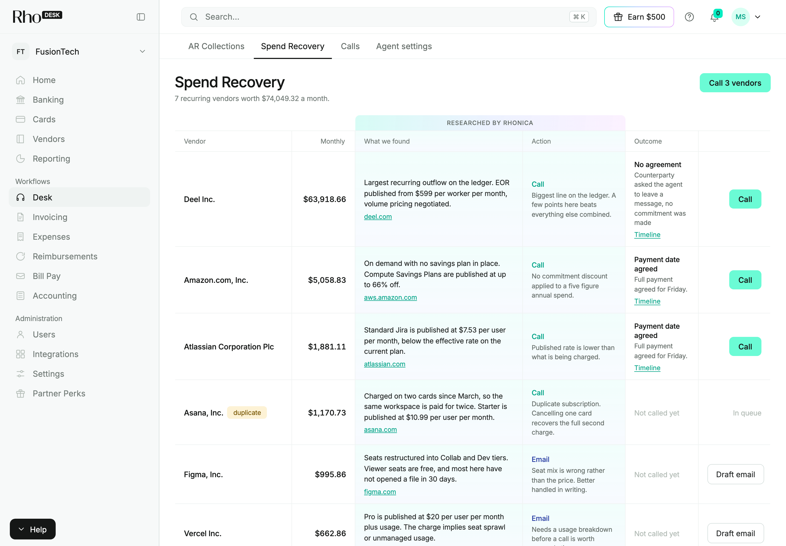
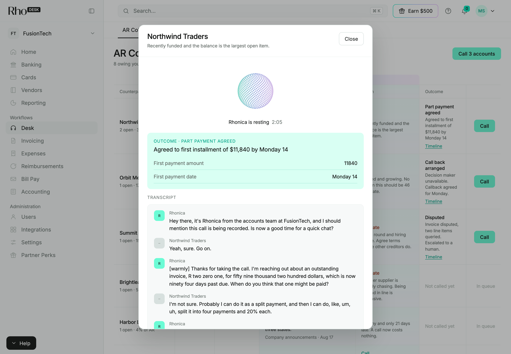

# Rho Desk

<!-- Image 1 of 4. The end card from the intro video: the Rho DESK lockup and
"Collections and spend recovery, handled by Rhonica." on black, 1920x1080.
Save it as docs/images/hero.png. -->


**Collections and spend recovery, handled by Rhonica.**

Rho Desk sits on top of a company's Rho account. It researches every customer
who owes the company money and every vendor it pays on repeat, decides who is
worth a call and why, and then Rhonica, an AI accounts specialist, picks up
the phone.

Rho shows you the record. Rho Desk does the work the record implies.

---

## 1. What it is

Four tabs, one job each.

| Tab | What it does |
| --- | --- |
| **AR Collections** | Every customer who owes you money, researched and ranked. Rhonica calls to agree a payment date |
| **Spend Recovery** | Every recurring vendor, with duplicates and price changes found. Rhonica calls to cancel or renegotiate, or the desk drafts the email |
| **Calls** | Every call placed, what was agreed, and the full transcript |
| **Agent settings** | What Rhonica may say, how far she may go, and what stops her |

Research runs on a schedule, once a day, and leaves a notification saying what
came back. The boards read as of that run, not as of whenever somebody last
pressed a button.

---

## 2. The problem

Two problems sit on every ledger, and nobody is watching either of them.

**The money owed to you goes stale.** **43%** of US B2B invoice value runs
overdue and **5%** is never collected. A dollar is **68.9%** collectable at
three months past due, and **21.4%** at one year. US companies pay collection
agencies **$13.6 billion a year** to make those calls, and the commission rises
as the dollar shrinks.

**The money you pay out runs on autopilot.** **36%** of SaaS licenses go
unused, and **81%** of software is bought outside IT, so one vendor lands on
three cards under three names and nobody sees them side by side.

*(Figures, scope and sources: [Appendix](#appendix-the-numbers).)*

---

## 3. AR Collections

<!-- Image 2 of 4. The AR Collections tab after a research run: the
"Researched by Rhonica" band filled in, a Call and an Escalate verdict, and at
least one outcome such as "Payment date agreed" with its Timeline link.
Save it as docs/images/ar-collections.png. -->


One row per customer who owes you money.

| Column | Shows |
| --- | --- |
| **Counterparty** | Open invoices, and that customer's share of total AR |
| **Outstanding** and **Days overdue** | Straight from the ledger |
| **What we found** | The research note, with its source and date |
| **Action** | The verdict (Call, Escalate or Leave) and the reason for it |
| **Outcome** | The last call's result and summary, and the **Timeline** |

**It cites its sources.** Every note links to where it came from. A customer
whose identity could not be verified never escalates on outside news, because
"Cedar & Co" in the headlines may be a different company.

**Distress changes the call, not the tab.** A customer showing verified
distress is marked **Escalate** instead of a routine **Call**: get a dated
commitment today, before the other creditors do.

**Nothing dials without a person.** A single call opens a review first: the
objective, what Rhonica may agree to, what she must not, and the number it will
dial. **Call N accounts** works the top of the board a few at a time
(`calls_per_run`, 3 by default), and pressing it is the approval, recorded on
every brief. Customers who qualify beyond that wait **In queue**.

---

## 4. Spend Recovery

<!-- Image 3 of 4. The Spend Recovery tab: recurring vendors with their
monthly spend, a duplicate badge, the "Researched by Rhonica" band, and a Call
or Draft email action. Save it as docs/images/spend-recovery.png. -->


One row per vendor you pay on repeat, with what it costs a month.

**It finds what is worth raising.** A subscription paid twice under two names
is flagged as a **duplicate**. A vendor that **changed** its price is a
finding. A vendor that merely publishes a price list is not, otherwise every
subscription would qualify.

**Rhonica calls, or the desk writes.** A vendor call aims at cancelling the
duplicate plan or moving to current published pricing, and nothing else. Where
email suits the vendor better, **Draft email** writes a short renegotiation
note from the same research. It is drafted only, never sent.

**Retention offers go to a person.** If a vendor offers a discount to stay,
Rhonica records the offer for someone to accept rather than accepting it on
the call.

Outcomes read **New terms agreed**, **Cancelled**, **Retention offer made** or
**Escalated to a human**.

The Rho sandbox is too small for subscription detection to fire, so three
synthetic vendors are added and badged **demo**. `DEMO_VENDORS=false` turns
them off.

---

## 5. Meet Rhonica

<!-- Image 4 of 4. Rhonica on a call: the call window with her orb, the live
caption ("Rhonica is talking", or "Rhonica is now locking in..." while it
dials), the transcript, and ideally the outcome banner once she hangs up.
Save it as docs/images/rhonica-call.png. -->


Rhonica is the AI accounts specialist who makes the calls. She is an
ElevenLabs agent (Qwen 3.5 thinks, Eleven v3 speaks, Scribe listens) on a real
phone line, and you can hear her in the browser before she dials anyone.

**She sounds like the accounts team.** The app picks her first line from the
call history. A first call introduces her from the accounts team and says the
call is being recorded. A follow-up says when you last spoke. She does not lead
with being an AI, says so plainly if asked, and never claims to be a person.

**She turns vague into a date.** Every call carries today's real calendar, so
"probably early next week" becomes "Does Monday the fourteenth work for you?"
instead of calendar arithmetic mid-call.

**She remembers.** Her last five calls to a counterparty go into her context.
What you see under **Timeline** is exactly what she works from, so a call back
a few hours later opens differently from a first call.

**She says numbers the way people do.** Spoken forms are computed in Python,
not left to the model. `$59,200.00` becomes "fifty nine thousand two hundred
dollars", and invoice `R204` becomes "R two zero four".

**She stays inside your lines.** Agent settings decide what she may agree to (a
payment date inside the window, instalments up to the limit, re-sending the
invoice) and what she must not do (offer a discount or write anything off,
threaten collections, legal action or credit reporting, or mention anything
learned from public sources).

**She writes the outcome back.** When she hangs up, a model reads the
transcript and records the result, the commitments and a summary on the board,
in Calls and on the Timeline.

**Talk to the agent** opens the same call in the browser with the same context,
so you can hear her before she dials. Rehearsals never count as calls.

Her first message, system prompt and variables live in
[agent_prompt.md](agent_prompt.md).

---

## 6. Calls and the timeline

**Calls** lists every call the desk has placed: when, the result, what was
agreed, and the transcript. Tiles along the top count calls placed, people
reached, commitments and value secured.

**Timeline**, on any board row, shows one counterparty's calls newest first.
That is the history Rhonica is given before she dials. A small dev-only
**Clear timeline** link wipes it, so a demo can start fresh.

---

## 7. Why this extends Rho

**Rho already issues the invoice. Rho does not collect it.**

That gap is a $13.6bn industry, served today by third parties. The data to
close it is already in the account.

| Rho already has | Rho Desk turns it into |
| --- | --- |
| Invoicing and customers | An AR board that Rhonica works |
| Card and transaction history | Duplicate subscriptions and price changes, found and called about |
| Counterparty names | A researched relationship with a verdict and a call history |
| Accounts and balances | Where your AR is concentrated, visible before it bites |

Three ways it compounds:

- **Action, not record.** Other spend tools report. This one does the thing
  the report implies.
- **The natural home for write access.** When Rho's writes land, the desk
  stops agreeing payment dates and starts settling them. The conversational
  layer is the hard part, and it is built.
- **Not Rho specific.** Rho is the first connector, not the product.

---

## 8. The stack

| Tool | Role | Why this one |
| --- | --- | --- |
| **Rho** | The ledger | Accounts, cards, transactions, invoices, customers. The public sandbox needs no account |
| **Tavily** | Research | Search plus full page extract, built for agents, returns citations |
| **Groq** | Inference | `gpt-oss-120b` for entity resolution, research signals, call briefs and outcomes |
| **ElevenLabs** | Rhonica | The only genuinely agentic part of the system. Browser and phone from one agent |
| **Telnyx** | Telephony | SIP trunk to PSTN. Usage priced, no per channel fee |
| **FastAPI + SQLite** | The desk | One process, one file, no infrastructure |

Anthropic and OpenAI are drop in alternatives to Groq via `LLM_PROVIDER`.
Twilio and Exotel are drop in alternatives to Telnyx via `ELEVENLABS_TELEPHONY`.

---

## 9. How each tool is used

### Rho

Fourteen read only GET operations across five resources. The client pages
every endpoint to exhaustion, retries 429s and 5xx, and strips empty params
because the sandbox silently ignores unknown ones.

Every write returns `405 Method Not Allowed`. That single fact shapes the
entire product: the desk cannot settle an invoice, so Rhonica calls the person
who can.

`RHO_MODE=fixtures` swaps in a generated 18 month ledger (273 transactions, 10
vendors, 10 customers) that is a field for field drop in replacement. The
sandbox has only 72 transactions, too few for subscription detection to fire.

### Tavily

Two or three searches per counterparty, plus a full page extract on vendor
pricing pages. Results feed one LLM call that turns them into signals with
severity and a source URL.

Tavily is the difference between "they owe you $59,200" and "they owe you
$59,200 and they raised a down round four days ago."

### Groq

Entity resolution and signal extraction run at `temperature=0`, because the
desk compares one run against the next and sampling noise would show up as
business change.

1. **Entity resolution.** 32 ledger descriptors to 28 real companies, batched
   into one call, about one second.
2. **Signal extraction.** Search results to structured findings with severity.
3. **The call brief.** The objective, the context and the lines Rhonica works
   within, written per call.
4. **The outcome.** A finished transcript to a result, commitments and a
   summary.

It also drafts vendor emails on request. Deciding who to call is arithmetic
and rules. Deliberately.

### ElevenLabs

Every call hands Rhonica its context as dynamic variables: the amount and
invoice in spoken form, what she may agree to and what she must not, the
research context, her opener, today's calendar and her call history. What she
does with them is in [Meet Rhonica](#5-meet-rhonica).

`get_invoice_details` is registered as a **client** tool, so it runs in the
page and needs no public URL. It also means `counterparty_id` comes from the
session rather than from the model, which is what stops Rhonica looking up
somebody else's invoice.

### Telnyx

A SIP trunk from ElevenLabs straight to the phone network. FQDN connection,
TCP transport, digest auth, no media encryption.

No part of this system is in the audio path, which is the point: no tunnel, no
public URL, nothing between ElevenLabs and the phone network. Transcripts come
back by polling the ElevenLabs conversation API rather than by webhook.

---

## 10. Architecture

```
  Rho API (or fixtures)
          │  accounts · transactions · cards · invoices · customers
          ▼
  ┌───────────────┐
  │ 1. EXTRACT    │  pure code
  │               │  group by counterparty, compute money in/out, open
  │               │  invoices, days overdue, recurrence, duplicates
  └───────┬───────┘
          ▼
  ┌───────────────┐
  │ 2. RESOLVE    │  1 LLM call, batched
  │               │  "AWS EMEA" + "AMZN AWS" → Amazon.com, Inc. (+domain)
  └───────┬───────┘
          ▼
  ┌───────────────┐
  │ 3. MONITOR    │  Tavily + 1 LLM call each · 8-way thread pool
  │               │  news, distress, pricing → signals with citations
  └───────┬───────┘
          ▼
  ┌───────────────┐
  │ 4. CLASSIFY   │  rules only, deterministic
  │               │  → a research note and a verdict per row
  └───────┬───────┘
          ▼
  ┌───────────────┐
  │ 5. CAPTURE    │  pure code
  │               │  snapshot every counterparty against this run id,
  │               │  diff against the previous run, store what moved
  └───────┬───────┘
          ▼
      SQLite  ──────────────►  Web UI (4 tabs)
          │                         │
          │                         ▼
          │                 ┌───────────────┐
          └────────────────►│ 6. ACT        │
            brief + guard   │ ElevenLabs    │──► browser (WebRTC)
            rails + history │ agent Rhonica │──► phone (Telnyx SIP → PSTN)
                            └───────┬───────┘
                                    │ get_invoice_details (client tool)
                                    ▼
                  back to SQLite: transcript, outcome, timeline
```

### Data flow, stage by stage

| Stage | In | Out | Cost |
| --- | --- | --- | --- |
| Extract | ~273 transactions, 17 invoices | 32 ledger groups | free, ~1s |
| Resolve | 32 groups | 28 companies with domains | 1 LLM call, ~1s |
| Monitor | 28 companies | ~90 signals with citations | ~70 Tavily + 28 LLM, ~20s |
| Classify | companies + signals | a verdict per row | free, instant |
| Capture | companies | 1 snapshot row each, plus a diff | free, instant |
| Act | 1 counterparty + brief + call history | a call, a transcript and an outcome | ~$0.005/min |

The monitor stage is entirely network bound, so it runs in an 8 way pool.
Sequentially it took 279 seconds; concurrently it takes 21, with byte
identical output. **13.5x**, and the ordering is preserved because results are
collected into a dict and applied in the original order.

### Modules

| File | Lines | Does |
| --- | --- | --- |
| `pipeline.py` | 901 | extract → resolve → monitor → classify → brief |
| `api.py` | 934 | FastAPI routes, the boards, the call workflow, the agent's tool endpoint |
| `voice.py` | 733 | ElevenLabs sessions, spoken forms, simulation, outcome extraction |
| `history.py` | 460 | Run records, per run snapshots, the diff |
| `fixtures.py` | 393 | Generated 18 month ledger, drop in for the API client |
| `db.py` | 358 | SQLite schema, migrations, JSON columns |
| `call_history.py` | 258 | The Timeline, and Rhonica's opener, calendar and memory |
| `today.py` | 239 | The morning briefing, derived from everything above |
| `llm.py` | 173 | Anthropic / OpenAI / Groq, JSON mode, rate limit retries |
| `tavily.py` | 165 | Search and extract, with a deterministic offline mode |
| `config.py` | 128 | Environment flags and their defaults |
| `rho.py` | 126 | Rho API client: pagination, retries, sandbox quirks |
| `scheduler.py` | 123 | The daily research run and its notification |
| `research_seed.py` | 117 | Research notes that stand in where live research has not run |
| `settings.py` | 100 | Persisted Agent settings that actually gate the agent |
| `static/` | 2,193 | The web UI, `index.html` and `app.js`, no build step |
| `tests/` | 1,213 | 83 tests: call history, the calendar and opener, call sync, the diff, Clear timeline |

**Deliberately not an agent loop.** Extraction and classification are
arithmetic and rules, so the output is reproducible. Models only write words:
company names, signals, briefs and outcomes. The one genuinely agentic thing in
the system is Rhonica on the phone, and ElevenLabs runs that.

---

## 11. Running it

```bash
./run.sh
```

Then open http://localhost:3000, press **Run research now** in **Agent
settings** (or wait for the daily run), and work the board from **AR
Collections**.

**Every external dependency degrades rather than fails.** With no API keys
configured the pipeline still completes end to end: generated ledger, offline
search, rule based classification, scripted calls. Each key upgrades one stage
independently, and the sidebar always shows which services are live, so the
output is never ambiguous about what produced it.

```bash
RHO_MODE=fixtures | live          # generated ledger, or the Rho API
TAVILY_API_KEY=                   # real research
LLM_PROVIDER=groq|anthropic|openai
ELEVENLABS_API_KEY=               # Rhonica in the browser
ELEVENLABS_AGENT_ID=
ELEVENLABS_PHONE_NUMBER_ID=       # Rhonica on the phone
ELEVENLABS_TELEPHONY=sip_trunk    # twilio | exotel | sip_trunk
DEMO_OVERRIDE_NUMBER=             # safety: pin all outbound calls to one number
DEMO_VENDORS=true                 # badged synthetic vendors for Spend Recovery
SCHEDULER_ENABLED=true            # the daily research run
RESEARCH_HOUR=17                  # when it runs, in server local time
MONITOR_CONCURRENCY=8
FIXTURE_DAYS_AGO=0                # read the ledger as it stood N days ago
```

**`DEMO_OVERRIDE_NUMBER` is a safety control.** Set it and every outbound
call goes to that number regardless of which counterparty is selected, which
makes it impossible for Rhonica to reach a real counterparty. Leave it set
until you have deliberately decided she should call real people.

### Deploying

One always-on process with one SQLite file, so any host that runs a Python web
service works. On Render's free plan:

| Setting | Value |
| --- | --- |
| Build command | `pip install -r requirements.txt` |
| Start command | `uvicorn rhodesk.api:app --host 0.0.0.0 --port $PORT` |
| Environment | The keys from `.env`, plus `SCHEDULER_ENABLED=false` |

The free plan sleeps after 15 minutes without traffic and resets its disk, so
after a wake-up the boards start empty: press **Run research now** again.

---

## 12. Design decisions worth knowing

### History: what counts as news

Every run is recorded, snapshotted per counterparty, and diffed against the
previous run. The diff is computed once and stored, so "what changed last
Tuesday" stays answerable.

Two rules shape it:

**Counterparties appear and disappear, but rarely do.** The resolver regroups
far more often than companies actually leave, so a counterparty folded into
another is reported as a **merge**, not a departure.

**Signals only ever appear.** News does not un-happen, and a live search
returns a slightly different set every time, so reporting "signal disappeared"
would be reporting search noise.

Counterparty ids come from the **ledger keys**, not from the resolved name.
The model is allowed to change its mind between runs; the transaction
descriptors are not.

### Degraded runs

A run that could not resolve entities, or could not research anybody, still
completes. What it must not do is present the resulting absence as news.

A rate limited resolver once made every counterparty look new. An exhausted
Tavily key once made every risk read "high to none", which the briefing would
have shown as good news.

So a run records **which stage** degraded, and the diff suppresses whatever
that stage feeds:

| Degraded stage | Suppressed |
| --- | --- |
| `resolve` | appeared, disappeared, merged |
| `research` | new signals, risk and classification changes |

Ledger arithmetic survives both, because it does not depend on the outside
world. The comparison says plainly that it was degraded rather than quietly
showing less.

### Settings are not decoration

The approval threshold gates dialling (`POST /api/calls` returns **412**
without an approver). The do-not-call list is refused at the API with **403**
rather than hidden in the UI, and skipped when a batch is worked. The payment
window, instalment limit, AI disclosure and company name all flow into the
brief Rhonica receives.

### One real call per batch

**Call N accounts** places the first call over the phone line and plays the
rest from a scripted simulation, so a demo shows a full batch without dialing
several people. Every call lands in the same table in the same shape, so the
board, Calls and the Timeline read the same way either way.

### Reading the ledger at an earlier moment

`FIXTURE_DAYS_AGO` rewinds the generated ledger: transactions that had not
posted yet are removed, invoices paid since are put back to unpaid. Same
ledger, earlier moment, nothing invented.

It exists for the history layer, which needs two runs that genuinely differ
before the diff has anything to say, and for testing that the diff reports the
right things when they do.

```bash
python seed_history.py 7     # runs the desk as of 7 days ago, then as of today
```

Against a live Rho account this is unnecessary: the ledger moves on its own.

---

## 13. API

| Route | Does |
| --- | --- |
| `GET /api/board` | Both boards, AR Collections and Spend Recovery, with totals and when research last ran |
| `POST /api/research` | Run the scheduled research now. Same code path, same notification |
| `POST /api/workflow` | Work a board: call every ready row on a tab. Pressing it is the approval |
| `POST /api/calls` | Place one call. 412 above the approval threshold, 403 on do-not-call |
| `GET /api/calls` · `GET /api/calls/{id}` | The call log, and one call polled live for the transcript |
| `POST /api/calls/{id}/end` | Hang up |
| `GET /api/call-stats` | Calls placed, people reached, commitments, value secured |
| `GET /api/counterparties/{id}` | Dossier: signals, invoices, calls |
| `GET /api/counterparties/{id}/calls` | One counterparty's call Timeline. `DELETE` clears it (dev only) |
| `POST /api/counterparties/{id}/brief` | Write the call brief |
| `POST /api/counterparties/{id}/draft` | Draft a renegotiation email to a vendor. Never sent |
| `POST /api/voice/session` | Start a browser rehearsal with Rhonica |
| `POST /api/tools/invoice` | `get_invoice_details`, scoped to the counterparty on the call |
| `POST /api/webhooks/elevenlabs` | Optional post-call webhook. Transcripts are polled either way |
| `GET /api/notifications` | Research results and failures, and the schedule |
| `GET /api/settings` · `PUT /api/settings` | Read and write Agent settings |
| `GET /api/changes` · `GET /api/runs` | What moved between runs, and the run history |
| `GET /api/status` | What is live, what is degraded, what last failed |

---

## 14. What is missing

Honest list, kept current in [PRD.md](PRD.md).

- **Contact data is missing.** None of the 32 counterparties carries a phone
  number, so real calls go to `DEMO_OVERRIDE_NUMBER` until contact enrichment
  is built.
- **Nothing is written back to Rho.** The v1 API is read only, so an agreed
  payment date lives on the board and the Timeline rather than on the invoice,
  and nothing follows up on the day it was promised.
- No auth. Anyone who can reach the app can read the ledger and place calls.
- Single business per token. Multi-entity is not modelled.
- Tests cover call history, the calendar and opener, call sync, the diff and
  Clear timeline. Nothing covers `extract` or `classify`, which carry the
  arithmetic.

---

## Appendix: the numbers

Everything quoted at the top, with scope and source. All figures are US
specific. No global, regional or non US data is used anywhere in this document.

### Receivables

Of the total value of B2B invoices issued by US companies:

| | Share of invoice value |
| --- | --- |
| Paid on time | 52% |
| Overdue | **43%** |
| Written off as bad debt | **5%** |

In electronics and ICT, terms average **50 days** from invoicing, **44%** of
invoices run overdue and **6%** is written off.

Source: [Atradius Payment Practices Barometer, US 2025](https://atradius.us/dam/jcr:5609b617-ac29-4e30-8b01-0663a01d94bd/payment-practices-barometer-us-2025-en.pdf). US only,
surveyed end Q2 to mid Q3 2025.

### Why calling early is the whole game

Probability of ever collecting a commercial dollar, by age past due:

| Age past due | Probability of collection |
| --- | --- |
| 3 months | **68.9%** |
| 6 months | **51.3%** |
| 1 year | **21.4%** |
| 2 years | **8.9%** |

Source: Commercial Collection Agencies of America, *Impact of Bad Debt
Write-Off on Sales*, cited in [AFM](https://www.afmcollects.com/insights/defining-high-performance-in-commercial-collections). US commercial (B2B).

A dollar loses roughly a third of its value in the first quarter and half by
six months. There is no cliff, just a steady bleed from the day it goes past
due. The economics run against the people doing the work: the cheapest moment
to call is the earliest, which is exactly when nobody has time, because
nothing is on fire yet.

### The outsourced alternative

US debt collection agencies are a **$13.6 billion industry** (2025). Agency
commission is lowest on accounts 90 to 270 days past due and highest past 360
days, so the fee rises exactly as the recoverable amount falls.

Source: [IBISWorld, Debt Collection Agencies in the US](https://www.ibisworld.com/united-states/industry/debt-collection-agencies/1474/).

### Software spend

| Finding | Figure |
| --- | --- |
| SaaS licenses left unused | **36%** |
| SaaS spend controlled by business units, not IT | **81%** (IT manages 15%) |
| Growth in expense-based SaaS spend, year over year | **267%** |

Source: [Zylo 2026 SaaS Management Index](https://zylo.com/news/2026-saas-management-index), built on 40 million SaaS
licenses and $75 billion in spend across 218 IT leaders.

The second row is the mechanism. When most software is bought by whoever
needed it that week, and expensed rather than procured, the same vendor ends
up on several cards under several descriptors. The card statement has the
evidence. It just reads as `ASANA.COM`, `SQ *ASANA` and `ASANA INC` on three
separate lines.

### A note on what is not here

Contingency fee percentages for US commercial collections are widely quoted
online at 25% to 35%, but every instance traced back to secondary content
rather than a primary source, and IBISWorld keeps its rate data behind a
paywall. The figure is therefore left out rather than cited weakly.

---

Independent project. Not affiliated with or endorsed by Rho.
